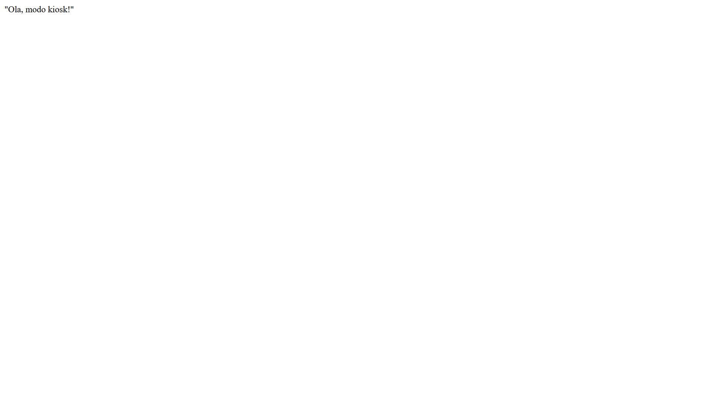

# Diário de Bordo - Sprint 1 (S1)

## Ferramentas Instaladas e Repositório
- VS Code configurado com as extensões Live Server, Prettier e HTML CSS Support.
- Conta no Figma criada.
- Repositório criado com as pastas: `frontend/recepcao/`, `frontend/atendente/` e `prototipos/`.
- Link do repositório: https://github.com/resenderavi/porteiro-digital/edit/main/diario.md

## Desafios e Dúvidas
No momento de testar o modo Kiosk, o terminal do PowerShell não reconheceu o comando padrão. A solução foi adaptar o comando usando `Start-Process chrome -ArgumentList "--kiosk", "--app=..."`.

## Jornadas do Sistema e Alinhamento
Após a leitura da documentação e a reunião de kick-off com toda a equipe (Ravi, Maria Eduarda, Lucas e Pedro), alinhamos as dependências do projeto e listamos as 3 jornadas principais:
1. Visitante chegando à recepção.
2. Atendente recebendo a notificação.
3. Responsável aprovando a visita.

## Comprovação do Kiosk

